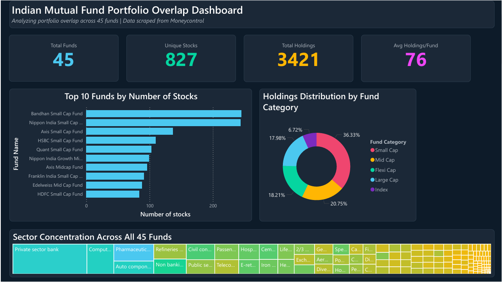

# Indian Mutual Fund Portfolio Overlap Dashboard

## Overview
An interactive Power BI dashboard analyzing portfolio overlap and concentration risk across **45 Indian equity mutual funds** spanning 5 categories — Large Cap, Mid Cap, Small Cap, Flexi Cap, and Index funds. Built on data scraped from Moneycontrol and previously analyzed using SQL ([companion project](https://github.com/DakshMalhotra256/mutual-fund-overlap-analyzer)).

## The Problem
Indian retail investors often hold multiple mutual funds thinking they're diversified. But are they really? If Fund A and Fund B both hold ICICI Bank, HDFC Bank, and Reliance — you're paying two expense ratios for the same stocks. This dashboard makes that overlap visible.

## Dashboard Pages

### Page 1 — Overview

- **4 KPI Cards**: Total Funds (45), Unique Stocks (827), Total Holdings (3,421), Avg Holdings/Fund (76)
- **Bar Chart**: Top 10 funds by number of stocks held — reveals which funds are most diversified vs concentrated
- **Donut Chart**: Holdings distribution across fund categories (Small Cap dominates at 36.33%)
- **Treemap**: Sector concentration across all 45 funds — Private Sector Banking and IT dominate

### Page 2 — Overlap Explorer (Interactive)

- **Category Slicer**: Horizontal tile buttons to filter by fund type (Large Cap, Mid Cap, etc.)
- **Fund Dropdown**: Select any specific fund to explore
- **Holdings Table**: Full breakdown of selected fund's stocks with sector, holding %, and market cap
- **Top 5 Holdings Bar Chart**: Visualizes the fund's biggest bets with conditional formatting
- **Sector Allocation Donut**: Shows how the selected fund distributes across sectors

*All visuals cross-filter — select a category, pick a fund, and the entire page updates instantly.*

### Page 3 — Stock Concentration Analysis

- **Top 25 Most Commonly Held Stocks**: Eternal Ltd. appears in 32 of 45 funds, ICICI Bank in 30, Axis Bank and HDFC Bank in 29 each
- **100% Stacked Bar Chart**: Sector allocation breakdown by fund category
- **Insight Cards**: Most popular stock, maximum fund presence count, and number of stocks appearing in 20+ funds (16 stocks)

### Page 4 — Category Deep-Dive

- **Category Slicer**: Compare fund types head-to-head
- **Grouped Bar Chart**: Average sector allocation by fund type — shows how Large Cap vs Small Cap vs Index funds differ
- **Fund Statistics Matrix**: Number of stocks, total weight, and average weight per fund with heatmap conditional formatting
- **Scatter Plot — Diversification vs Concentration**: Each dot is a fund. X-axis = number of stocks held, Y-axis = top 5 holdings weight. Reveals which funds are truly diversified vs just holding many stocks

## Key Insights
- **Eternal Ltd.** is the most commonly held stock, appearing in **32 of 45 funds**
- **16 stocks** appear in 20+ funds — investors holding multiple funds likely own the same stocks repeatedly
- **Small Cap funds** hold the most stocks (Bandhan Small Cap: 245 stocks) but are genuinely diversified
- **Index funds** are the most concentrated — fewer stocks with higher individual weights
- The scatter plot reveals that holding many stocks doesn't guarantee diversification — some funds with 50+ stocks still have 40%+ weight in just their top 5

## DAX Measures Created
| Measure | Formula | Purpose |
|---------|---------|---------|
| Avg Holdings Per Fund | `DIVIDE(COUNTROWS(table), DISTINCTCOUNT(table[fund_name]))` | KPI card on Page 1 |
| Stock Popularity | `CALCULATE(DISTINCTCOUNT(table[fund_name]))` | Fund presence count |
| Most Held Stock | `TOPN(1, VALUES(table[stock_name]), ...)` | Insight card on Page 3 |
| Max Fund Presence | `MAXX(VALUES(table[stock_name]), ...)` | Insight card on Page 3 |
| Stocks In 20+ Funds | `COUNTROWS(FILTER(SUMMARIZE(...), [fc] >= 20))` | Insight card on Page 3 |
| Stock Count | `DISTINCTCOUNT(table[stock_name])` | Scatter plot X-axis |
| Top5 Concentration | `SUMX(TOPN(5, SUMMARIZE(...)), [hp])` | Scatter plot Y-axis |

## Data
- **Source**: Scraped from [Moneycontrol](https://www.moneycontrol.com) using Python (BeautifulSoup)
- **Records**: 3,421 holdings across 45 funds
- **Columns**: fund_name, stock_name, sector, holding_pct, market_cap, fund_category
- **Fund Categories**: Large Cap (5), Mid Cap (5), Small Cap (10), Flexi Cap (10), Index (5), and others
- **Data as of:** February/March 2026

## Project Structure
    ├── MF_Overlap_Dashboard.pbix          # Power BI dashboard file
    ├── mutual_fund_holdings_dashboard.csv  # Dataset used
    ├── dashboard_preview.pdf               # PDF export of all 4 pages
    ├── screenshots/                       # Page screenshots
    │   ├── page1_overview.png
    │   ├── page2_overlap.png
    │   ├── page3_concentration.png
    │   └── page4_category.png
    └── README.md
    
## How to View
1. **Screenshots & PDF**: Browse this repo — screenshots are in the README, PDF is downloadable
2. **Interactive Dashboard**: Download `MF_Overlap_Dashboard.pbix` and open in [Power BI Desktop](https://www.microsoft.com/en-us/power-platform/products/power-bi/desktop) (free)
3. **Data**: The CSV file is included if you want to explore the raw data

## Limitations
- Data scraped from Moneycontrol at a single point in time — holdings change monthly with portfolio rebalancing
- Equity holdings only — debt, cash, and foreign equity positions are excluded
- Fund category classification is based on fund name keywords, not official SEBI categorization
- The dashboard requires Power BI Desktop (Windows only) to interact with — PDF export provided for other platforms

## Tools Used
- **Power BI Desktop** — Dashboard creation, DAX measures, interactive visuals
- **Python** — Data scraping (BeautifulSoup) and cleaning (Pandas)
- **DAX** — Custom calculated measures for KPIs and scatter plot metrics

## Related Projects
- [Mutual Fund Overlap Analyzer (SQL)](https://github.com/DakshMalhotra256/mutual-fund-overlap-analyzer) — The SQL analysis project that this dashboard visualizes

## Author
**Daksh Malhotra**
B.Tech Engineering Physics, Delhi Technological University
